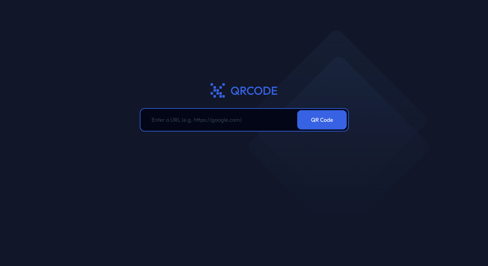
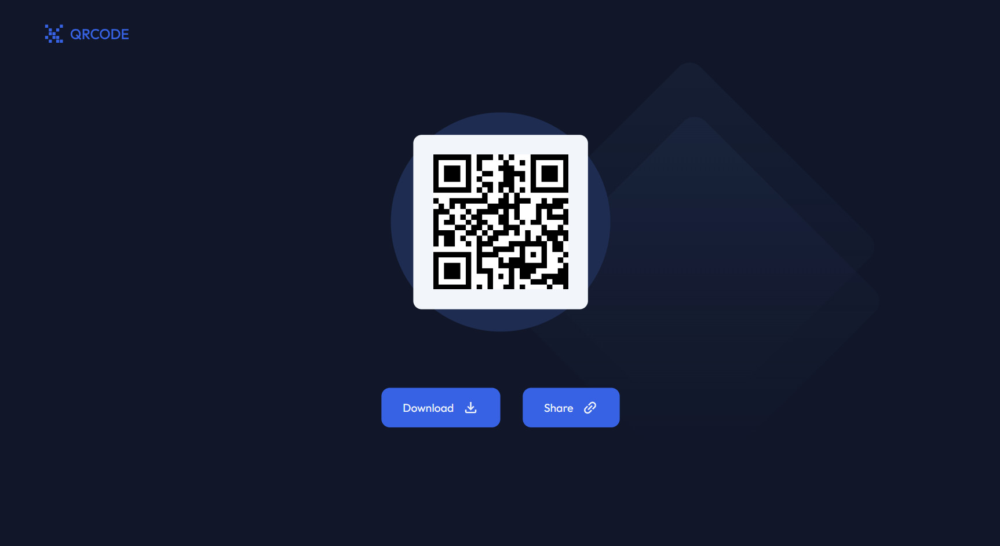

<!-- Please update value in the {}  -->

<h1 align="center">QR Code Generator</h1>

<div align="center">
   Solution for a challenge from  <a href="http://devchallenges.io" target="_blank">Devchallenges.io</a>.
</div>

<div align="center">
  <h3>
    <a href="https://h-yoshikawa44.github.io/ch-qr-code-generator/">
      Demo
    </a>
    <span> | </span>
    <a href="https://devchallenges.io/solution/30957">
      Solution
    </a>
    <span> | </span>
    <a href="https://devchallenges.io/challenge/qa-code-generator">
      Challenge
    </a>
  </h3>
</div>

<!-- TABLE OF CONTENTS -->

## Table of Contents

- [Table of Contents](#table-of-contents)
- [Overview](#overview)
  - [Desktop](#desktop)
  - [Mobile](#mobile)
  - [Built With](#built-with)
- [Features](#features)
- [How To Use](#how-to-use)
- [learned/improved](#learnedimproved)
- [Acknowledgements](#acknowledgements)
- [Contact](#contact)

<!-- OVERVIEW -->

## Overview

### Desktop





### Mobile


### Built With

<!-- This section should list any major frameworks that you built your project using. Here are a few examples.-->

Base

- [HTML](https://developer.mozilla.org/ja/docs/Web/HTML)
- [CSS](https://developer.mozilla.org/ja/docs/Web/CSS)
- [JavaScript](https://developer.mozilla.org/ja/docs/Web/JavaScript)
- [Node.js](https://nodejs.org/)：20.16.0
- [Vite](https://ja.vitejs.dev/)：5.4.2

Other major libraries

- [Lightning CSS](https://lightningcss.dev/)
- [qrcode](https://github.com/soldair/node-qrcode)

## Features

<!-- List the features of your application or follow the template. Don't share the figma file here :) -->

This application/site was created as a submission to a [DevChallenges](https://devchallenges.io/challenges) challenge. The [challenge](https://devchallenges.io/challenge/random-quote) was to build an application to complete the given user stories.

- [x] Create a QR code generator app that matches the given design.
- [x] Use HTML to create the basic structure.
- [x] Add inputs, buttons,.. according to the design.
- [x] Use vanilla JavaScript to add interactivity.
- [x] Users can enter a URL.
- [x] User can see a QR quote after selecting the QR code button.
- [x] User can download QR quote image by selecting download button.
- [x] User can copy Quote to the clipboard by selecting Share button.
- [x] The page should be responsive on different screen sizes.
- [x] Deploy the solution and submit Repository URL and Demo URL.

※URL parameters such as queries and characters other than single-byte alphanumeric characters are not supported.

## How To Use

<!-- Example: -->

To clone and run this application, you'll need [Git](https://git-scm.com) and [Node.js](https://nodejs.org/en/download/) (which comes with [npm](https://www.npmjs.com/)) installed on your computer. From your command line:

```bash
# Clone this repository
git clone https://github.com/h-yoshikawa44/ch-qr-code-generator.git
# or
git clone git@github.com:h-yoshikawa44/ch-qr-code-generator.git

# Install dependencies
npm install

# Run the Vite
npm run dev
```

## learned/improved

- How to configure Vite to change the root directory.
- How to set up as MPA in Vite.
- How to use the QR Code Generation Library.
- How to write regular expressions in URLs.
- How to create an image download with the a tag.

## Acknowledgements

<!-- This section should list any articles or add-ons/plugins that helps you to complete the project. This is optional but it will help you in the future. For exmpale -->

- [GitHub - node-qrcode](https://github.com/soldair/node-qrcode)
- [MDN - URL: URL() コンストラクター](https://developer.mozilla.org/ja/docs/Web/API/URL/URL)
- [Viteでルートディレクトリを変更する方法](https://mai.kosodante.com/vite%E3%81%A7%E3%83%AB%E3%83%BC%E3%83%88%E3%83%87%E3%82%A3%E3%83%AC%E3%82%AF%E3%83%88%E3%83%AA%E3%82%92%E5%A4%89%E6%9B%B4%E3%81%99%E3%82%8B%E6%96%B9%E6%B3%95-2/)
- [Viteでマルチページアプリを作る](https://zenn.dev/s_takashi/articles/d033401905ccf9)
- [CSSで画像を重ねる+中央に配置する方法のメモ](https://qiita.com/sawakoshi_yy/items/d272dbc7df8b12f2c406)
- [正規表現まとめ ＋ メールアドレスとURLの正規表現例](https://qiita.com/str32/items/a692073af32757618042)
- [【Javascript】ボタンを押すとcanvasを画像としてダウンロード](https://qiita.com/lookman/items/d93dd62a41f17a4d2de8)

## Contact

- Website：[h-yoshikawa44.com](https://h-yoshikawa44.com)
- GitHub：[@h-yoshikawa44](https://github.com/h-yoshikawa44)
- X：[@yoshi44_lion](https://x.com/yoshi44_lion)
